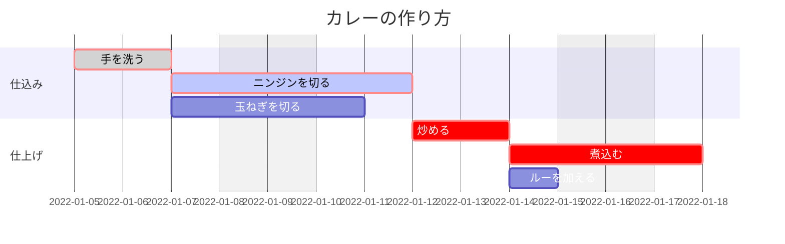

# mermaid_test
marmaid sample

```mermaid
gantt

  dateFormat YYYY-MM-DD
  excludes weekends

title カレーの作り方

section 仕込み
  手を洗う       :crit,done,   t1, 2022-01-05, 2d
  ニンジンを切る  :crit,active, t2, after t1,   3d
  玉ねぎを切る    :active　　　  t3, after t1,   2d
  
section 仕上げ
  炒める　　　　　:crit,        t4, after t2 t3,   2d
  煮込む         :crit,        t5, after t4,   2d
  ルーを加える   :       　　　 t6, after t4,   1d
  
```
